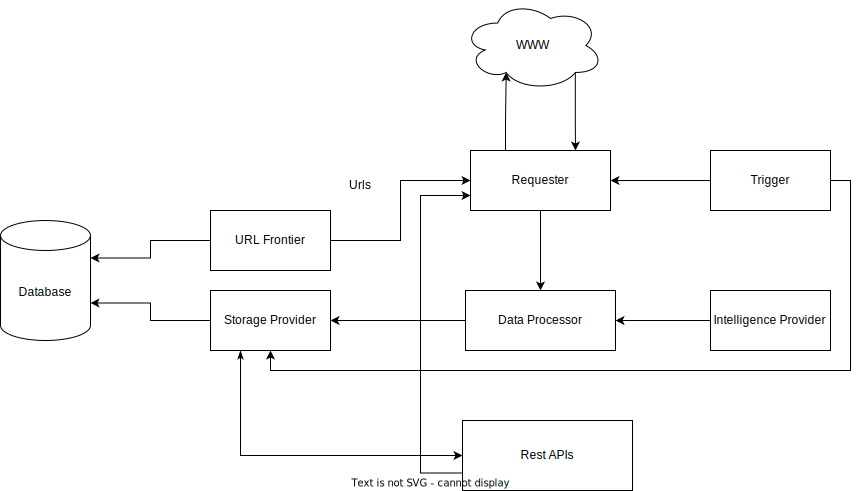

# Vidura Sense Software Design

## Table of Contents

* TOC
{:toc}

## Rivision History

| Version | Authors | Description   | Date       |
| ------- | ------- | ------------- | ---------- |
| 1.0     | Bikash  | Initial Draft | 2023-07-17 |
| 1.1     | Bikash  | Project Structure Description| 2023-07-27 |

## 1 Introduction

The purpose of this document is to specify the requirements for an intelligent web crawler bot.
The crawler will crawl the World Wide Web to gather info.

## 2 Requirements

### 2.1 Spider
 
 Spider often shortened to crawler, is an Internet bot that systematically browses the World Wide Web and that is typically operated by search engines for the purpose of Web indexing.

### 2.2 Requester

This module will have the apis to call urls and fetch content.

* Call [Frontier](#23-url-frontier) for urls to get content form World Wide Web.
* Call multiple urls based upon their preference provided by frontier concurrently.
* Pass web contents to the [Data Processor](#24-data-processor)

### 2.3 URL Frontier

This contains the apis to feed urls for every trigger.

* Fetch urls from database whose content is 3(get it from configuration "update_interval") days old or more (ie current_date - last_updated >=3 days) and return as array.

### 2.4 Data Processor

This contains the apis to process data.

* Get content form [Requestor](#22-requester).
* Process it to schema refer to [HtmlPage](./Schemas.md#1-htmlpage) and [FeedItem](./Schemas.md#2-feeditem)
* Filter content using Intelligence provider APIs.
* After processing send it to Storage Provider

### 2.5 Data Storage

This module contains apis to store data in databases or other storage.

* Store content in database received from [Data Processor](#24-data-processor)

### 2.6 Scheduler

* This module triggers [Requester](#22-requester) on regular intervals.

### 2.7 Api Server

* This module contains the restapis for triggered jobs,metrics and web content summary.

## 3 System Diagram



## 4 Sequence Diagrams


## 5 Project Structure

``` code

.
├── config                  Config files
├── deployment              Deployment files
├── docs                    Documentation
│   └── diagrams            Documentation Diagrams
├── internal                Project Internal Code
│   ├── data            
│   │   ├── entity          Data entities module
│   │   └── processor       Data processors module
│   ├── datastorage
│   │   ├── mongo-store     Mongodb storage module
│   │   ├── natsio          Nats messaging module
│   │   └── redis-store     Redis storage module
│   ├── url-frontier        
│   ├── helper              Helper utilities
│   ├── requester           Data requestors
│   ├── apiserver           Rest api module(Based on Gin)   
│   │   └── handlers        Handlers for Gin
│   ├── scheduler           Scheduler modules(Based on Gocron)
│   ├── spider              Spider framework module
│   │   └── robotstxt-util  robots.txt valication module
│   └── system              Common system providers (logging,config etc)
└── logs                    Log store directory


```
